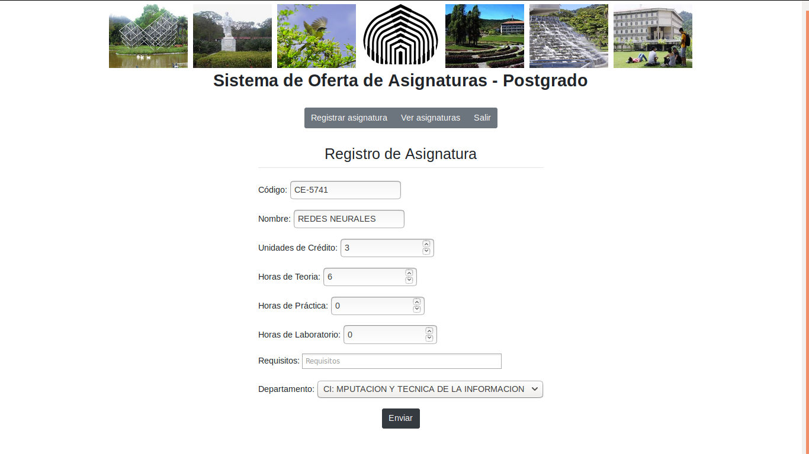
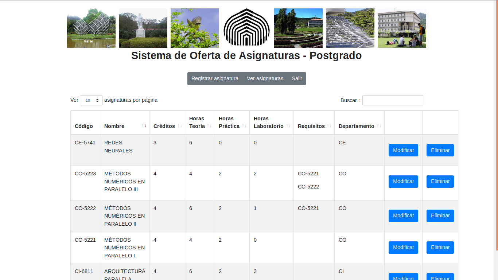
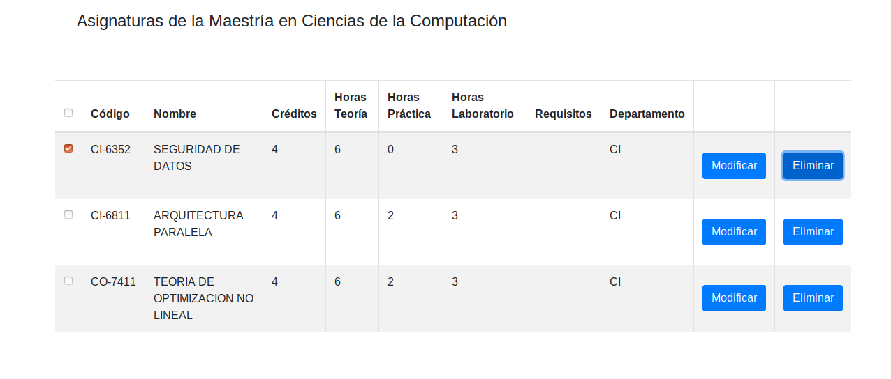
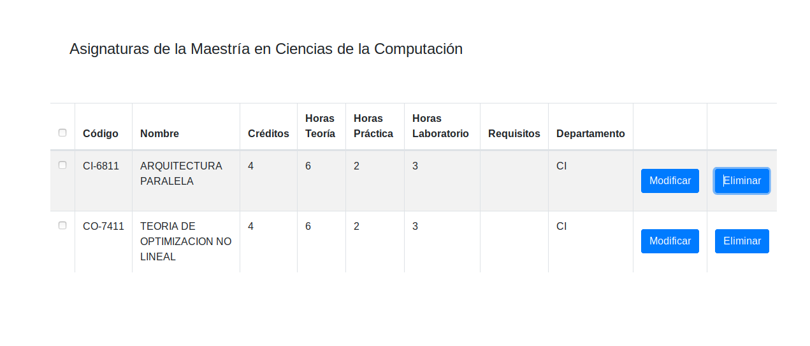

# Manual del Usuario

Este documento tiene la finalidad de ofrecer, de forma clara y sencilla, las pautas que le permitirán al usuario de la aplicación 
aprender a acceder y usar a las diversas herramientas de trabajo ofrecidas dentro del sistema. 

Se proporcina una serie de imágenes que servirán de guia para entender el comportamiento del presente módulo, es decir, los resultados
esperados al ingresar a ciertas funcionalidades específicas. 

El presente documento presentará actualizacines durante la primera etapa de desarrollo hasta la culminación del mismo.

## 1-Inicio

### 1.1 Registro de Cuenta
  Al presionar el botón "Registrarse" verá el siguiente formulario.

  
 #### Formulario de Registro
 Para poder crear un nuev usuario de forma satisfactoria debe llenar "Todos" los campos, a continuación de ofrece una explicación con el nombre del campo y el tipo de dato se espera recibir en él.
 
 - Nombre de Usuario: dirección de correo electrónico personal/institucional.
 - Departamento: código del Departamento al cual estará adscrita la cuenta. El código se compone de dos letras Mayusculas 
 - Contraseña: codigo alfanumérico de 8 dígitos o más.
 - Confirmación: repetir nuevamente la contraseña.

### 1.1 Inicio de Sesión

Para poder acceder al sistema el usuario debe proporcionar los datos de identificación indicados en las casillas:

  - Nombre de Usuario: correo personal/institucional asociado a la cuenta.
  - Contraseña: ingresar la contraseña ingresada durante el registro de la cuenta.

  Si el ingreso fué exitoso verá la siguiente pantalla con las Herramientas de Gestión de Asignaturas:
  
  

## 2. Herramientas de Gestión de Asignaturas:
Una vez ingrese al menu de asignaturas podrá apreciar las siguientes herramientas de gestion:

  - Registrar Asignatura: muestra un Formulario con los campos requeridos para crear una nueva asignatura.
  - Ver Asignatura: lista las asignaturas existentes y ofrece las funciones CRUD.
  
### 2.1 Registrar Asignatura-Formulario (Solo para Jefes de Departamento).

  Al ingresar a la opción "Registrar Asignatura" se mostrará un formulario para añadir la nueva asignatura. A continuación se describen los formatos que deben poseer los valores a ingresar en cada campo:
  
  1-Código: LL-NNNN (LL=código del departamento al que perteneca, N=Numero entero).
  
  2-Nombre: Nombre de la materia (DEBE ESTAR EN MAYÚSCULAS). 
  
  3-Unidades de Crédito: Numero entero mayor que 0 y menor que 9.
  
  4- Horas de Teoria: Numero Natural mayor que cero.
 
  5- Horas de Laboratorio: Numero Natural mayor que cero.
  
  6- Horas de Practica: Numero Natural Mayor que cero.
  
  7-Requisitos: Al hacer click sobre el campo se desplegará la lista de asignaturas existente para que señale aquellas que serán requisito (deben aprobarse) para ver la asignatura nueva.
  
  8- Departamento: Al hacer click sobre el campo se desplegará la lista de Departamentos, haga click sobre el departamento cuyo código coincid con las primeras dos letras del codigo de Asignatura
  
  Ejemplo: Agreguemos una nueva Asignatura llamada Redes Neuronales, perteneciente al departamento de Ciencias de la Economía, debe tener 6 horas de teoría semanal, no tiene laboratorios ni requiere prácticas.
 
  
  
  Una vez haya finalizado se presiona el botón de "Enviar", inmediatamente volveremos a la página de visualización de asignaturas donde se visualizará la actualización.
 
  

  

### 2.2 Ver Asignaturas

### 2.2.1 Consultar una Asignatura (Todo usuario).
(En desarrollo)
### 2.2.2 Modificar información de una asignatura (Solo para Jefes de Departamento).

  1-Para modificar los datos de una asignatura presione el botón "Modificar", inmediatamente debería mostrarse el siguiente formulario.
  
  2- Modifique los datos respectivos.

  3-Para Guardar los cambios presiona el botón "Modififar". Una vez hecho regresará inmediatamente a la tabla de asignaturas con los cambios actualizados.

### 2.2.3 Eliminar una Asignatura (Solo para Jefes de Departamento).

1- Marcar la casilla con la Asignatura que desee eliminar.

2- Presione Boton Eliminar

3- Confirmación:
  Una vez presionado el botón de "Eliminar" se mostrará una ventana modal solicitado confirmar la solicitud.

  

Las siguientes imágenes muestran el resultado de c/u de las opciones:

  3.1- Eliminar:
 
   
  
  3.1- No:

  
