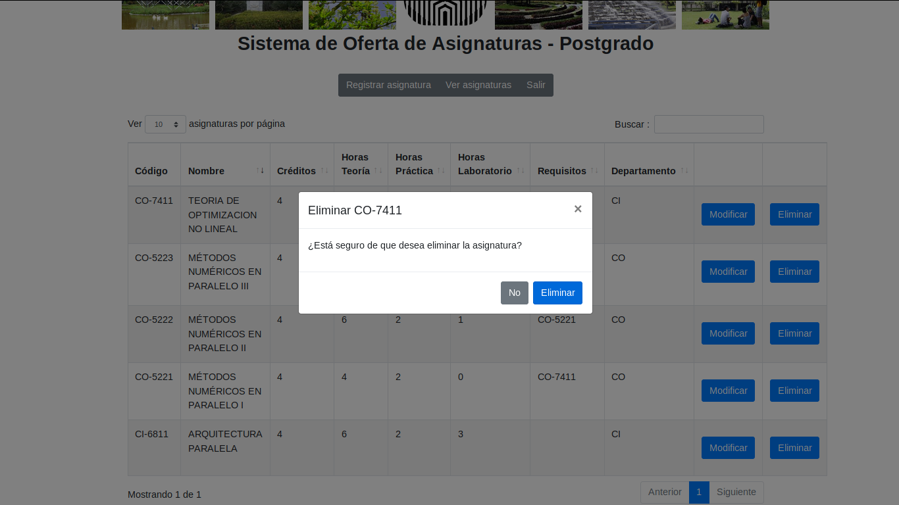

# Manual del Usuario

Este documento tiene la finalidad de ofrecer, de forma clara y sencilla, las pautas que le permitirán al usuario de la aplicación 
aprender a acceder y usar a las diversas herramientas de trabajo ofrecidas dentro del sistema. 

Se proporcina una serie de imágenes que servirán de guia para entender el comportamiento del presente módulo, es decir, los resultados
esperados al ingresar a ciertas funcionalidades específicas. 

El presente documento presentará actualizacines durante la primera etapa de desarrollo hasta la culminación del mismo.

## Inicio

### Registro de Cuenta.

  
 #### Formulario de Registro
 - Nombre de Usuario: dirección de correo electrónico personal/institucional.
 - Departamento: código del Departamento al cual estará adscrita la cuenta. El código consiste en dos letras Mayusculas 
 - Contraseña: codigo alfanumérico de 8 dígitos o más.
 - Confirmación: repetir nuevamente la contraseña.

### Inicio de Sesión

Para poder acceder al sistema el usuario debe proporcionar los datos de identificación indicados en las casillas:

  - Nombre de Usuario: correo personal/institucional asociado a la cuenta.
  - Contraseña: ingresar la contraseña ingresada durante el registro de la cuenta.

  Si el ingreso fué exitoso verá la siguiente pantalla con las Herramientas de Gestión de Asignaturas:
  
  

## Herramientas de Gestión de Asignaturas:
Una vez ingrese al menu de asignaturas se pueden apreciar dos herramientas de gestion:

  - Registrar Asignatura: muestra un Formulario con los campos requeridos para crear una nueva asignatura.
  - Ver Asignatura: lista las asignaturas existentes y ofrece las funciones CRUD.
  
### Registrar Asignatura-Formulario (Solo para Jefes de Departamento).

  

### Ver Asignaturas

### Consultar una Asignatura (Todo usuario).
(En desarrollo)
### Modificar información de una asignatura (Solo para Jefes de Departamento).
(En desarrollo)
### Eliminar una Asignatura (Solo para Jefes de Departamento).

1- Marcar la casilla con la Asignatura que desee eliminar.

2- Presione Boton Eliminar

  

3- Confirmación:

  

  3.1- Eliminar:
 
   
  
  3.1- No:

  
