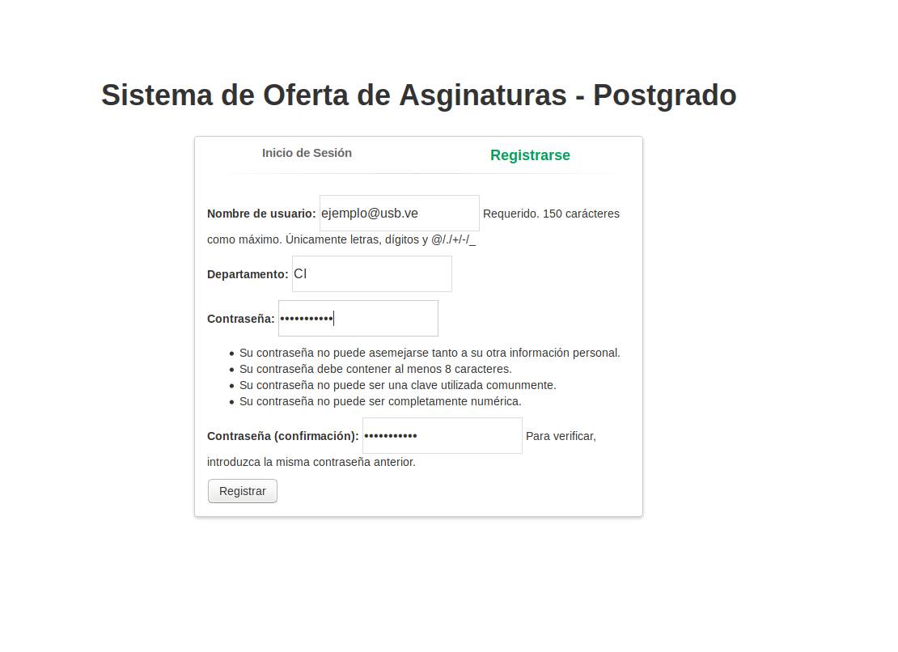
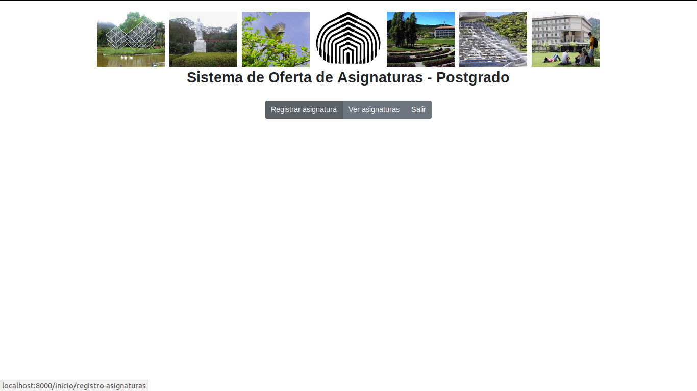
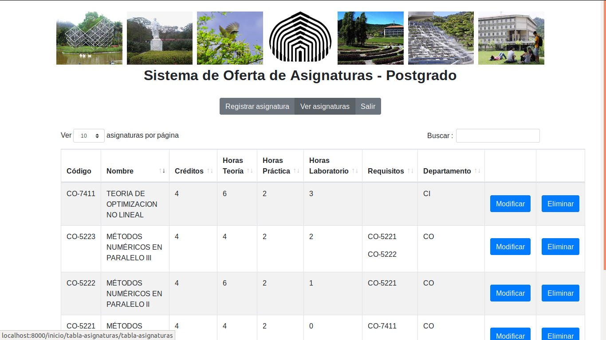

# Manual del Usuario

El presente documento tiene la finalidad de ofrecer, de forma clara y sencilla, las pautas que le permitirán al usuario de la aplicación aprender a acceder y usar a las diversas herramientas de trabajo ofrecidas dentro del sistema. Para ello se presenta a continuación una serie de ejemplos explicando como llevar a cabo las tareas listadas al inicio.

Se proporcina adicionalmente una serie de imágenes que servirán de guia para entender el comportamiento del presente módulo, es decir, los resultados esperados al ingresar a ciertas funcionalidades específicas. 

El presente documento presentará actualizacines durante las etapas de desarrollo.

Los jefes de Departamento poseen las siguientes funcionalidades:

  * Agregar Nuevas asignaturas para los titulos de postgrado.
  
  * Registrar nuevos profesores.
 
  * Realizar operaciones basicas de gestion sobre los campos descritos anteriormente (__Crear, borrar, modificar, consultar__).
 
  * Seleccionar las asignaturas de posgrado que tentativamente van a ser dictadas el proximo trimestre para construir la oferta del departamento.
 
  * Seleccionar los profesores que la pueden dictar como posibles candidatos para la oferta trimestral del departamento.
 
  * Enviar a los profesores asginados (Via cooreo electronico) un enlace con un formulario para que seleccionen la(s) asignatura(s) que deseen dictar en el respectivo trimestre.
 
  * Completar la asignacion de profesores a asignaturas.
  
  Los profesores pueden registrarse en el sistema y:
  
  * Responder formulario de asignaturas asignadas por el jefe de departamento en la construcción de la oferta tentativa.

## 1-Inicio

Una vez instalado los requisitos del software y seguido las instrucciones indicadas en el archivo [README](https://github.com/cocococosti/IngSoft1-DeltaDev/blob/master/README.md) aparecerá como vista inicial la pantalla de autenticación del sistema donde el usuario inicia sesión o se registra, si es la primera vez que ingresa en el sitio.

.png "Login") 

### 1.1 Registro de Cuenta
  Al presionar el botón "Registrarse" verá el siguiente formulario.

  
 #### Formulario de Registro
 Para poder crear un nuev usuario de forma satisfactoria debe llenar "Todos" los campos, a continuación de ofrece una explicación con el nombre del campo y el tipo de dato se espera recibir en él.
 
 - Nombre de Usuario: dirección de correo electrónico personal/institucional.
 - Departamento: código del Departamento al cual estará adscrita la cuenta. El código se compone de dos letras Mayusculas 
 - Contraseña: codigo alfanumérico de 8 dígitos o más.
 - Confirmación: repetir nuevamente la contraseña.

Una vez llenado todos los campos, el usuario debe hacer click en el botón Registrar. Será redirigido al la pestaña de Inicio de Sesión donde llenará los respectivos campos para ingresar en el sistema.

Nota: Actualmente todos los usuarios se registran como Jefes de Departamento. En las próximas actualizaciones se deshabilitará esta suposición.

Nota 2: Solo se puede ingresar con alguno de los departamentos válidos como CI, PS, BC, BO, CC, etc. 

Nota 3: Esta funcionalidad aún esta en desarrollo. Se implementó como un stub pues era necesaria para otros requerimientos del sistema.

### 1.1 Inicio de Sesión

Para poder acceder al sistema el usuario debe proporcionar los datos de identificación indicados en las casillas:

  - Nombre de Usuario: correo personal/institucional asociado a la cuenta.
  - Contraseña: ingresar la contraseña ingresada durante el registro de la cuenta.

  Si el ingreso fué exitoso verá la siguiente pantalla con las Herramientas de Gestión de Asignaturas:
  
  

## 2. Herramientas de Gestión de Asignaturas:
Una vez ingrese al menu de asignaturas podrá apreciar las siguientes herramientas de gestion:

  - Registrar Asignatura: muestra un Formulario con los campos requeridos para agregar una nueva asignatura en el catálogo.
  - Ver Asignatura: catálogo de asignaturas existentes donde es posible modificarlas, eliminarlas, ordenarlas y filtrarlas.
  
### 2.1 Registrar Asignatura-Formulario (Solo para Jefes de Departamento).

  Al ingresar a la opción "Registrar Asignatura" se mostrará un formulario para añadir la nueva asignatura. A continuación se describen los formatos que deben poseer los valores a ingresar en cada campo:
  
  1-Código: XX-YYYY (XX=código del departamento al que perteneca, Y=Numero entero).
  
  2-Nombre: Nombre de la materia. 
  
  3-Unidades de Crédito: Numero entero mayor que 0 y menor que 9.
  
  4- Horas de Teoria: Numero entero mayor que cero.
 
  5- Horas de Laboratorio: Numero entero mayor que cero.
  
  6- Horas de Practica: Numero entero mayor que cero.
  
  7-Requisitos: Al hacer click sobre el campo se desplegará la lista de asignaturas existente para que señale aquellas que serán requisito (deben haber sido aprobradas por el estudiante) para ver la asignatura nueva.
  
  8- Departamento: Al hacer click sobre el campo se desplegará la lista de Departamentos, haga click sobre el departamento cuyo código coincide con las primeras dos letras del codigo de la asignatura.
  
  Ejemplo: Agreguemos una nueva Asignatura llamada Redes Neuronales, perteneciente al departamento de Ciencias de la Economía, debe tener 6 horas de teoría semanal, no tiene laboratorios ni horas de práctica.
 
  
  
  Una vez haya finalizado se presiona el botón de "Enviar", inmediatamente volveremos a la página de catálogo donde se visualizará la actualización.
 
  

  

### 2.2 Ver Asignaturas

### 2.2.1 Modificar información de una asignatura (Solo para Jefes de Departamento).

  1-Para modificar los datos de una asignatura presione el botón "Modificar" en la respectiva entrada del catálogo, inmediatamente se muestra el siguiente formulario.
  
  2- Modifique los datos respectivos.

  3-Para Guardar los cambios presiona el botón "Modififar". Una vez hecho regresará inmediatamente a la tabla de asignaturas con los cambios actualizados.

### 2.2.2 Eliminar una Asignatura (Solo para Jefes de Departamento).

1- Presione Boton Eliminar en la respectiva entrada del catálogo.

2- Confirmación:
  Una vez presionado el botón de "Eliminar" se mostrará una ventana modal solicitado confirmar la solicitud.
  
  

Al dar click en "Eliminar" la asignatura será borrada del catálogo.

### 2.2.3 Buscar Asginaturas

El usuario puede filtrar el catálogo para hallar las asignaturas por su código o por su nombre, utilizando la funcionalidad de búsqueda ubicada en la esquina superior derecha de la tabla.

* Búsqueda por código: Ingresar el código de la asignatura en la barra de búsqueda. 

* Búsqueda por nombre: Ingresar el nombre de la asignatura en la barra de búsqueda.

### 2.2.4 Ordenar Asignaturas

El usuario puede ordenar las asignaturas del catálogo de forma alfabetica ascendente, descendente o por el código de las asignaturas.

* Orden alfabético ascendente: Dar click en la flecha que apunta hacia arriba en el encabezado de la tabla, en la columna Nombre.

* Orden alfabético descendente: Dar click en la flecha que apunta hacia abajo en el encabezado de la tabla, en la columna Nombre.

## 3. Herramientas de Gestión de Profesores:

### 3.1 Registrar Profesor-Formulario (Solo para Jefes de Departamento).

  
  
  
 
  Como ejemplo se procese a agregar a la profesora Marlene Goncalves, con sus respectivos campos.
  
  
  

Nótese que el Departamento muestra una opción única, esto se debe a que cada profesor puede pertenecer únicamente a un departamento (el del jefe que lo agrega).

### 3.2 Consultar Profesores partenecientes al Departamento (Solo para Jefes de Departamento).

  

## 4. Herramientas de Gestión de Ofertas Trimestrales:

### 4.1 Crear Oferta Trimestral

El usuario debe hacer click en la pestaña de "Oferta de Asignaturas", luego para inicar el proceso de creación de la oferta debe hacer click en el boton "Agregar Asignatura" y aparecerá la siguiente venta emergente:

En el campo asignatura apareceran las materias registradas en el paso 2.1 del presente documento. En el campo de profesores aparecen los profesores registrados en el sistema en el punto 3.
**Nota:** Proximamente los profesores que apareceran seran quienes en el punto 3 hayan indicado que suele dictar dicha asignatura.
Se pueden seleccionar varios profesores y apareceran en diferentes entradas de la tabla con la misma asginatura.

### 4.2 Enviar Correos a Profesores

Una vez hayan sido cargadas las asignaturas en la oferta con los respectivos profesores tentativos, se debe hacer click en el boton "Enviar Oferta". Esta opcion enviará un enlace que lleva  a un formulario personalizado a cada profesor que pertenece a la oferta a traves del correo electrónico.

**Nota:** Durante la etapa de desarrollo se utilizará la herramienta de django [Console backend](https://docs.djangoproject.com/en/1.11/topics/email/#console-backend) que escribe el email en la salida estandar. Proximamente el envio de correo se realizará de forma real.

### 4.3 Formulario de Selección de Asignaturas

En el correo que se envia a cada profesor, se encuentra un enlace que redirige al profesor a un formulario personalizado donde se le muestran las asignaturas a las que ha sido seleccionado y decide confirmar o no, que dictará esas asignaturas, tal como se muestra a continuación:

Este formulario es de caracter privado y solo puede ser accedido por los profesores a través del enlace enviado. 

### 4.4 Completar la Oferta

Una vez que los profesores respondan al formulario, o puede suceder el caso en que hayan profesores que no lo respondan, en la oferta se actualiza el color del nombre del profesor en la respectiva entrada de la tabla.

Si el color está en rojo, quiere decir que no hay respuesta del profesor aun, o  que este la rechazó. Si el color es el mismo que el resto de los campos de la entrada de la tabla, quiere decir que el profesor aceptó dictar esa materia para el respectivo trimestre.

