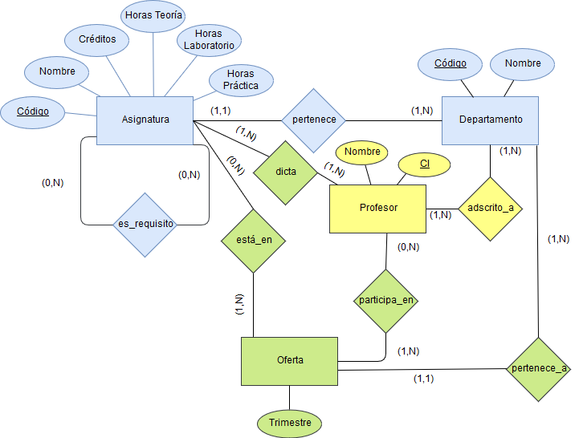

# Diseño e Implementación del Modelo ER de la Base de Datos.

 ##1-Diseño
 
 
   ###1.1 Clasificación de colores:
   
   
   
  -Color azul: Entidades y relaciones previamente diseñadas e implementadas por el equipo de desarrollo Delta Developers.
  -Color amarillo: Entidades y relaciones previamente diseñadas por el equipo de desarrollo BIG Developers.
  -Color Verde: Entidades y relaciones en proceso de implementación. Durante la fase actual de desarrollo. Estos elementos del diseño pueden estar sometidos a cambios hasta su completa validación.
  
             
 ##2-Implementación
  
